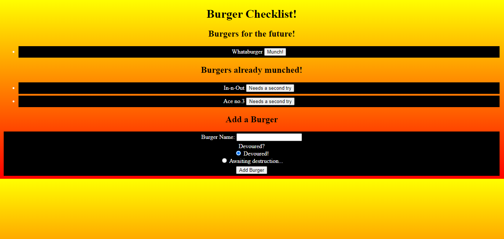

# Burger Logger

## Description: 
Tasked with providing an app which could keep track of different burgers the user has had, and wants to try, we utilized javascript, express.js, express-handlebars, node, as well as mysql. We have created an app that is fun and easy to use and should fit the outlined requirements. The code contained in this repo was largely provided by and worked on in class and does not solely originate with the owner.
## Table of Contents

-[Description](#description)

-[Installation](#installation)

-[Instructions](#instructions)

-[Licenses](#licenses)

-[Deployed](#deployed)

-[Contact](#contact)

-[Contributors](#Contributors)

-[Testing](#Tests)

## Installation:
Our application required the use of node, mysql, express and express-handlebars.
## Instructions:
Our app is pretty simple, you are presented with a list of burgers that the user still wants to try, and one with burgers they have already tried. They have the option of "checking off" burgers that were on the want list, or putting tried burgers back on if they want a second attempt. 
### Licenses: 

### Deployed: 
[https://enigmatic-beach-85013.herokuapp.com/](https://enigmatic-beach-85013.herokuapp.com/)

### Contact:

[Github](https://github.com/boylepeter)

[LinkedIn](https://www.linkedin.com/in/peter-boyle-22b5071b7/)

Email: [Boyle.Peter614@gmail.com](Boyle.Peter614@gmail.com)

### Contributors: 
The code contained in this repo was largely provided by and worked on in class and does not solely originate with the owner. 
Please feel free to get in contact if you would like to add on or collaborate.

### Tests: 
We tested through github as well as heroku, for deployment. We also utilized localhost for development.